# 🤖 VFS Automation Bot

A powerful and efficient automation **bot** designed to streamline **VFS appointment checking** using **Python**, **Selenium**, **ChromeDriver** and **FFmpeg**. Built for reliability and ease of use, this bot automates repetitive **browser tasks**, **reduces manual effort** and speeds up the entire workflow with minimal setup.

 
 


## 📘 Overview

The **VFS Bot** is an automated **Python** based tool designed to monitor and interact with **VFS Global appointment** pages. It helps users **check slot availability**, streamline repetitive tasks, and boost speed and efficiency. Built with **Selenium**, it can mimic real browser behavior and reduce manual workload.


## ✨ Features

- 🔍 Live Slot Monitoring – Automatically checks available appointment dates & times.
- 🚀 Fast Browser Automation – Uses Selenium WebDriver with optimized Chrome settings.
- 🔔 Smart Notifications – Alerts users when new slots become available.
- 🧩 Modular Architecture – Easy to customize or extend with additional features.
- ⚙️ Configurable Settings – User-friendly configuration file for easy setup.
- 🔐 Safe Automation – Runs within browser limits to mimic natural user activity.


## 📌 Technologies Used

### **Tkinter** Tkinter is Python’s standard GUI library used for building cross-platform desktop applications.

### [**CustomTkinter**](https://github.com/TomSchimansky/CustomTkinter) extends Tkinter with:

- Modern, consistent design  
- Light & Dark themes  
- High-DPI scaling  
- Fully customizable modern widgets  

Together, they ensure a smooth UI experience on **Windows**, **macOS** and **Linux**.

| Component | Description |
|------------|--------------|
| **Language** | Python 3.x |
| **GUI Framework** | CustomTkinter |
| **Database** | SQLite3 |
| **Core Libraries** | Tkinter, CustomTkinter, SQLite3 |
| **Automation Engine** | Selenium WebDriver |
| **Browser Driver** | [ChromeDriver](https://googlechromelabs.github.io/chrome-for-testing/#stable) (64-bit) |
| **Media Processing** | [FFmpeg](https://github.com/BtbN/FFmpeg-Builds/releases/tag/latest) (latest build) |


## 🛠 Requirements

To run the **VFS Bot** smoothly, you need a modern Windows system and a stable environment.

- 🪟 Windows 10 or higher
- 🌐 Latest Google Chrome browser
- ⚙️ Intel/AMD 5th Gen or newer processor
- 🧠 8GB RAM or more
- 🚀 15MB/s or faster internet connection
- 🧩 Google Chrome 119.x (64-bit)

_`(Use the currently working or latest version)`_


## 🎞️ How to Download & Use FFmpeg

1. Download FFmpeg:<br/>
`https://github.com/BtbN/FFmpeg-Builds/releases/tag/latest`
1. Choose the ZIP file for your operating system.
1. Extract (unzip) the downloaded ZIP file.
1. Open the extracted folder → go to the bin directory.
1. You will find: `ffmpeg.exe`, `ffprobe.exe`, `ffplay.exe`.
1. Copy all three files and paste them into your project folder: **VFSv2023.C3/**


## 🧩 How to Download & Use ChromeDriver

1. Download ChromeDriver:<br/>
`https://googlechromelabs.github.io/chrome-for-testing/#stable`
1. Select and download the ZIP file matching your OS.
1. Extract (unzip) the ZIP file.
1. Open the extracted folder and locate **chromedriver.exe**.
1. Copy the `chromedriver.exe` file.
1. Paste it into your project directory: **VFSv2023.C3/webdriver/**


## 🧰 Installation

### Step 1. Clone the repository

```bash
git clone https://github.com/iamx-ariful-islam/VFS-Bot.git
cd VFS-Bot
```

### Step 2. Create & Activate Virtual Environment

```bash
# for Windows
python -m venv venv
venv\Scripts\activate

# for Linux / MacOS
python3 -m venv venv
source venv/bin/activate
```

### Step 3. Install Python Dependencies

The `requirements.txt` file, lists of all the Python libraries that "**_vfs bot_**" depends on and installs those packages from the file:

```bash
pip install -r requirements.txt
# or (Linux / MacOS)
sudo pip install -r requirements.txt
```

### Step 4. Run the Application
```bash
python main.py
```


## 📂 Folder Structure
Here’s the structure of the **VFS Bot** project:

```bash
vfs-bot/
│
├── screenshots/
├── main.py
├── notes.txt
│── LICENSE
├── README.md
└── requirments.txt
```


## 🖼️ Screenshots

Here are some screenshots of the `VFS Bot` project:

**Login Window**<br/>
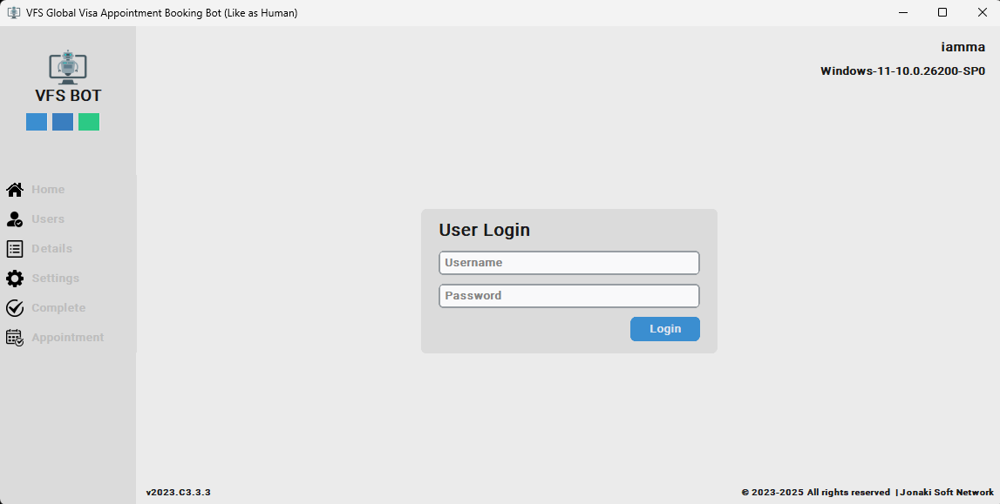<br/>
**Home Window**<br/>
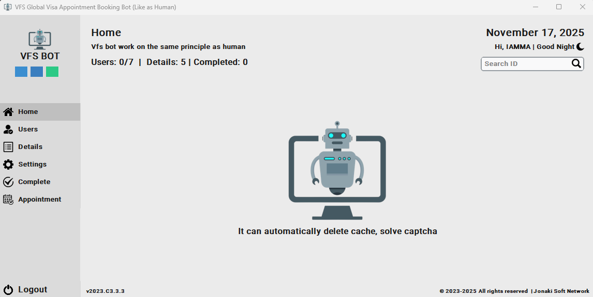<br/>
**Users Window**<br/>
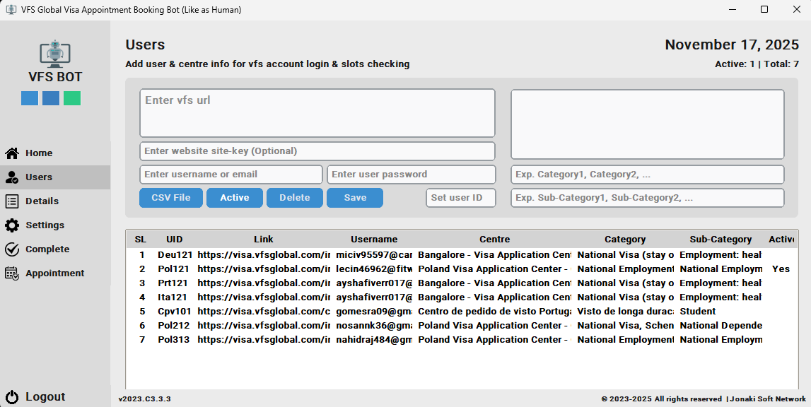<br/>
**Details Window**<br/>
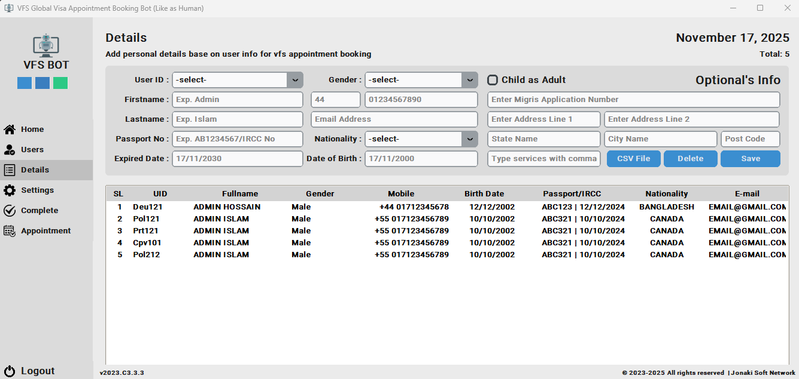<br/>
**Settings - Version Window**<br/>
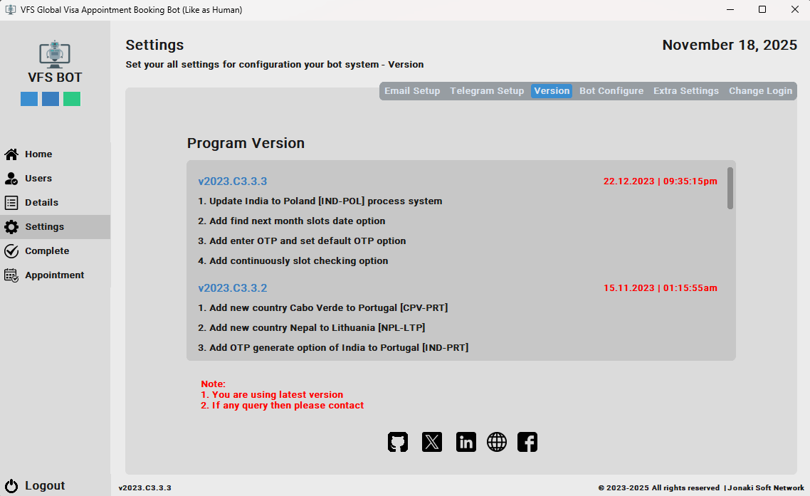<br/>
**Settings - Email Setup Window**<br/>
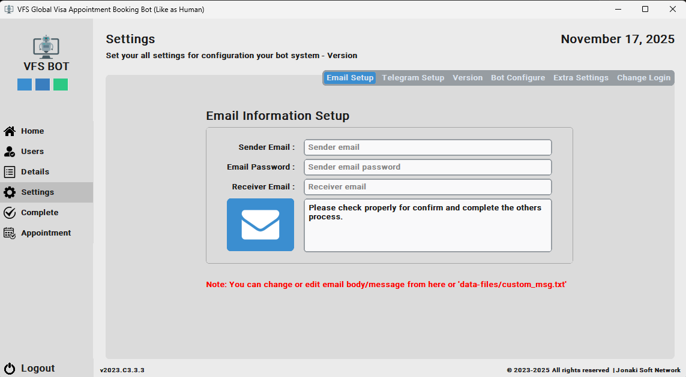<br/>
**Settings - Telegram Setup Window**<br/>
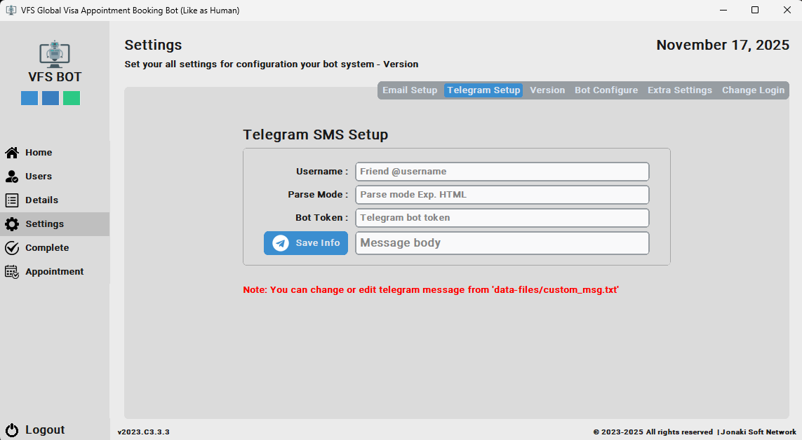<br/>
**Settings - Bot Configure Window**<br/>
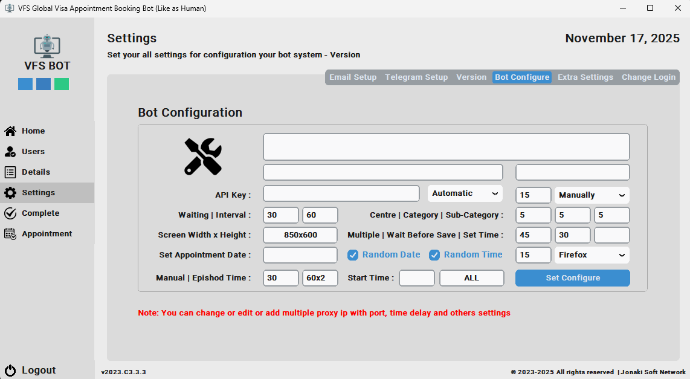<br/>
**Settings - Extra Settings Window**<br/>
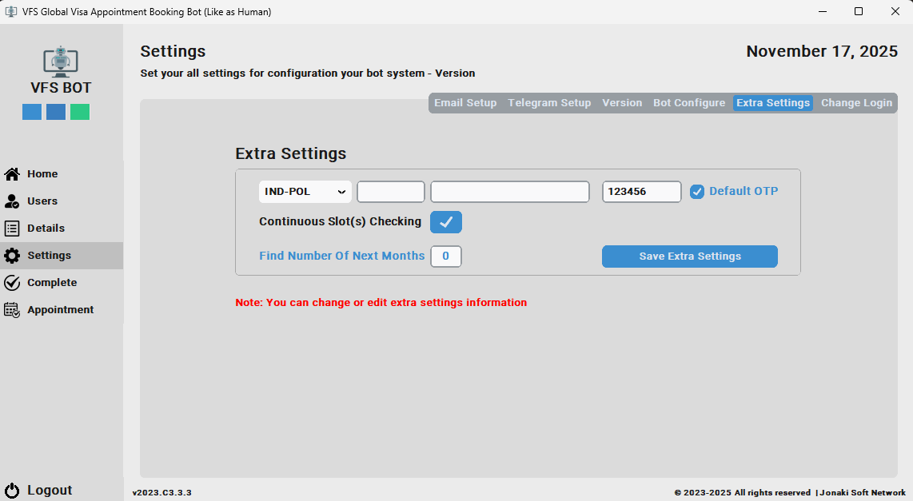<br/>
**Settings - Change Login Window**<br/>
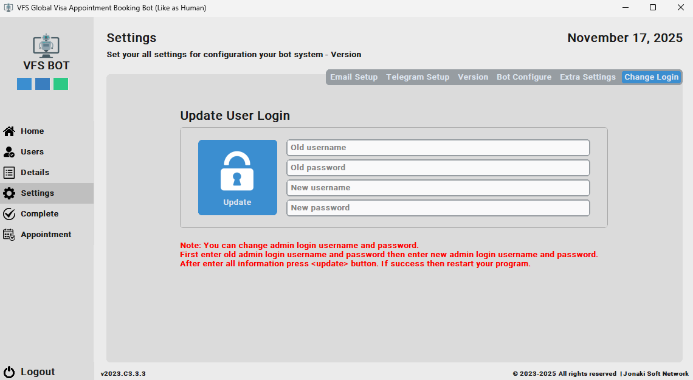<br/>
**Complete Window**<br/>
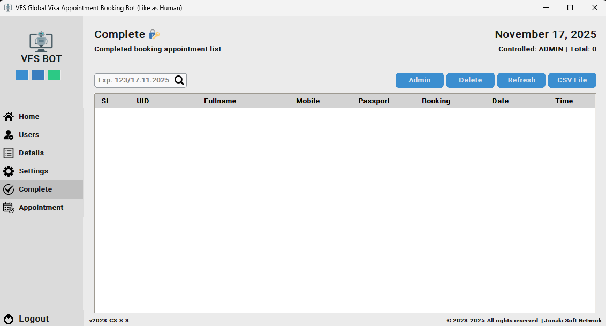<br/>
**Appointment Window**<br/>
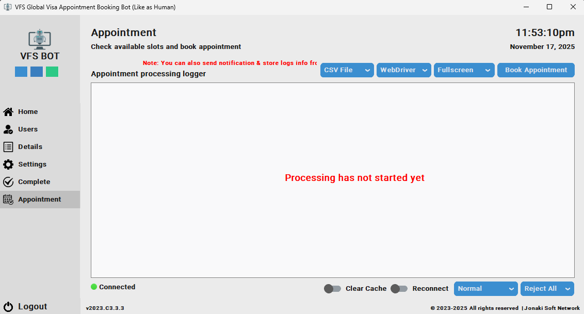<br/>
**Appointment - Process Window (Dark Mode)**<br/>
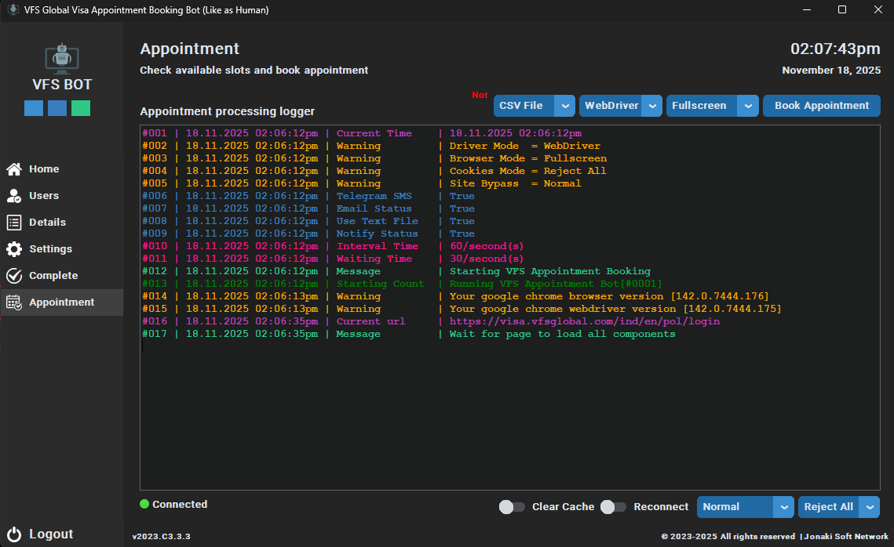<br/>

<details>
  <summary><strong>📁 See More Screenshots (Click to Expand)</strong></summary><br>

**Appointment Process - Browser Side**<br/>
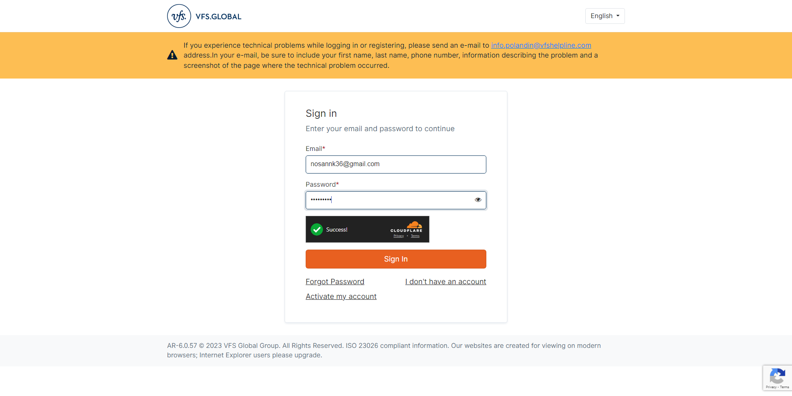<br/>
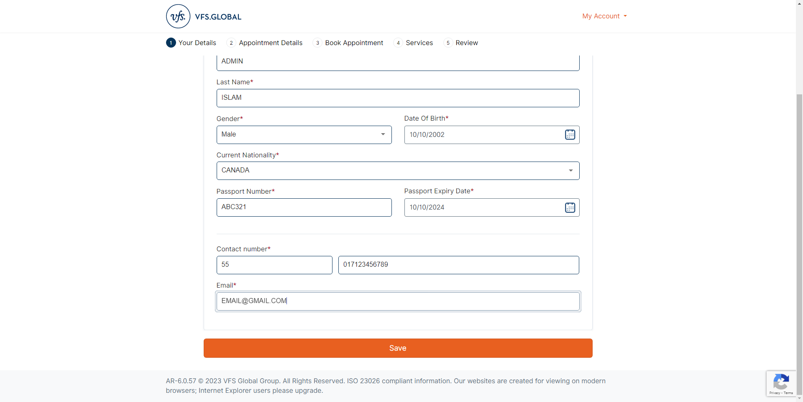<br/>
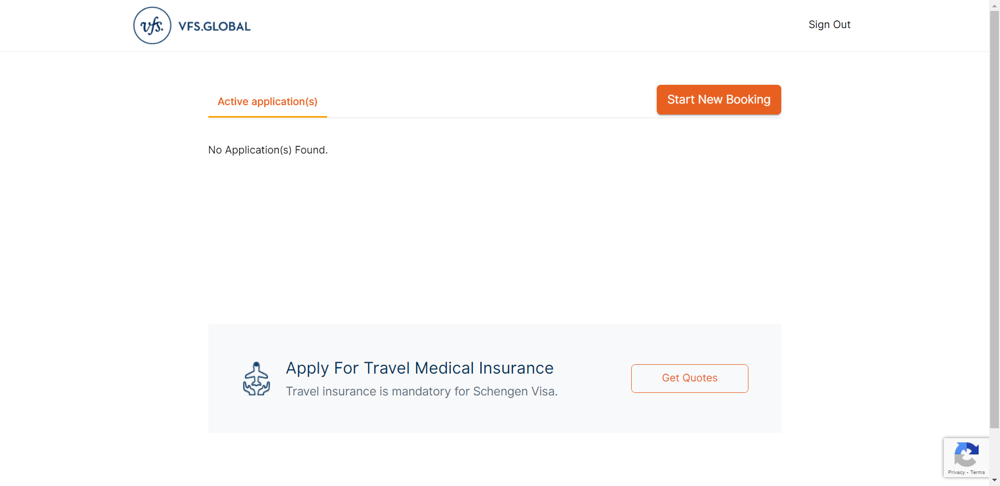<br/>
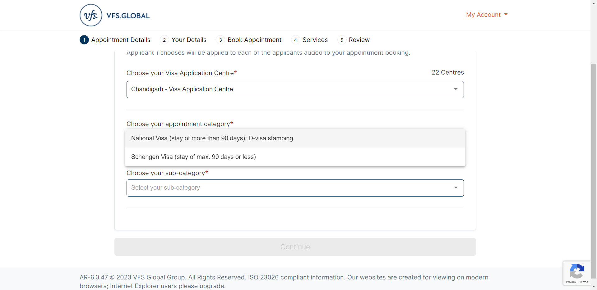<br/>
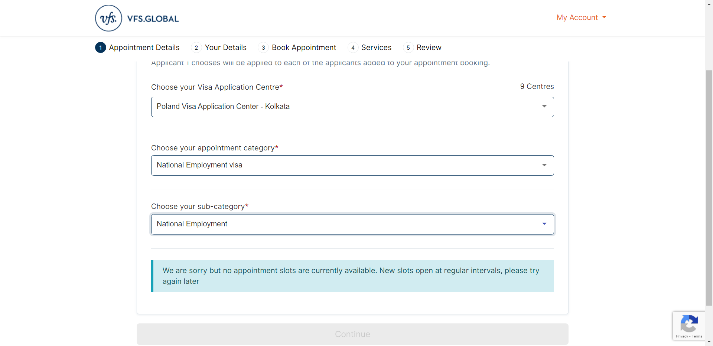<br/>
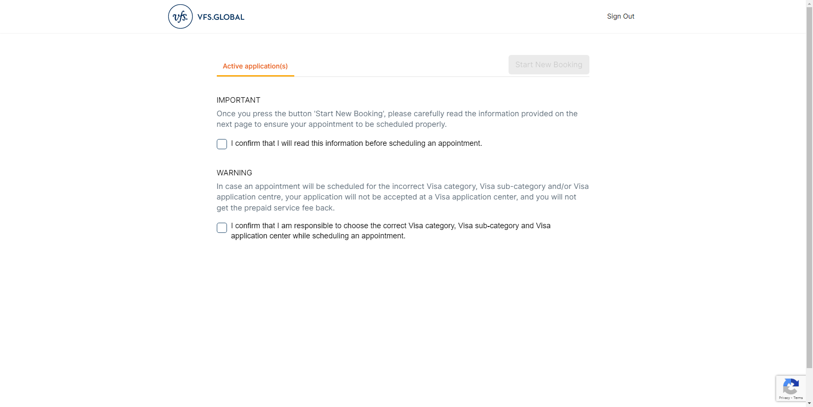<br/>

</details>


## 📄 Notes

```
- Unzip 'VFSv2023.C3.zip' file
- Goto 'VFSv2023.C3' folder (Note: Don't change anythings)
- Click 'VFS.exe' file
- Then enter your/user password keys and security keys(Exp. Please see the keys.txt file)
- Then login using enter username and password(Default username: admin & password: admin)
- After login configure your bot system
- After complete all settings restart your program
- Open program then enter the username and password to enter the program
- Then click 'Appointment' tab button and click 'Book Appointment' button
- Then your process is started
- See your process log and screenshots from 'logs-data' and 'screenshots' folder
........................
Contact us on any online platform (Facebook, GitHub, LinkedIn, X, or our website)
```
Read the full details about `VFS Bot`, notes here: **👉 [notes.txt](notes.txt)**


## 🤝 Contributing

Contributions, suggestions, and feedback are always welcome! ❤️<br/>
To contribute:

1. Fork the repository
2. Create a new branch (`feature/new-feature`)
3. Commit your changes
4. Push and submit a Pull Request

💬 You can also open an issue if you’d like to discuss a feature or report a bug.


## 🌐 For more or connect with me

<p align='center'>
  <a href="https://github.com/iamx-ariful-islam"></a>&nbsp;&nbsp;
  <a href="https://bd.linkedin.com/in/iamx-ariful-islam"></a>&nbsp;&nbsp;
  <a href="https://x.com/mx_ariful_islam"></a>&nbsp;&nbsp;
  <a href="https://www.facebook.com/iamx.ariful.islam/"></a>
</p>


## 📜 License

The [MIT](https://choosealicense.com/licenses/mit/) License (MIT)


## 💖 Thank You for Visiting!

> “Good design is about making things simple yet significant”  

> — *Md. Ariful Islam*
